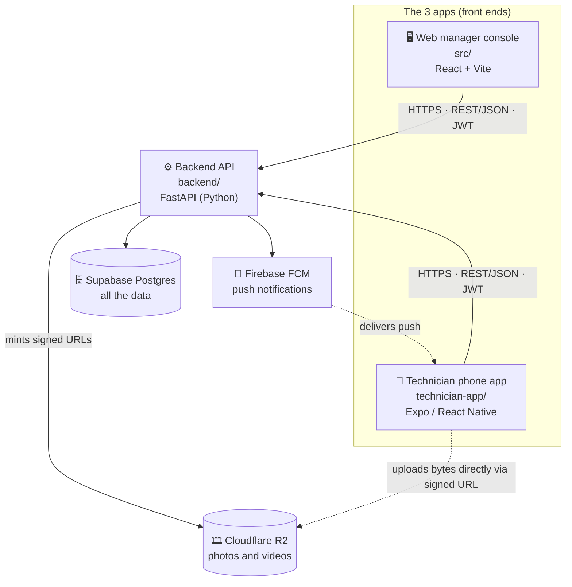
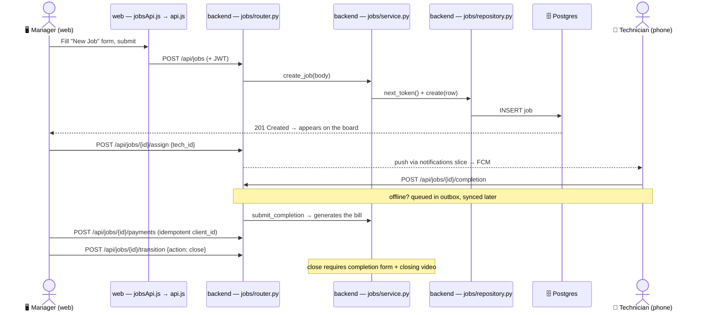

# CODE-MAP — How to read, navigate, and own this codebase

> **Who this is for:** the person who needs to *understand and lead* FixFlow, not just run it.
> It assumes you can program but have never been *taught this repo*. It is a **course, not a
> cheat-sheet** — it uses FixFlow's own code as the textbook. Work through it with the repo open.
> Every file path and code snippet below is real; click the paths to open them.
>
> When you finish, you should be able to: find any feature, open any file knowing what role it
> plays, trace a feature end-to-end across all three apps, explain *why* the architecture is the way
> it is, and review a teammate's pull request like a lead.
>
> The other docs (`ARCHITECTURE.md`, `docs/SOLUTION-ARCHITECT-GUIDE.md`, `docs/PLAYBOOK.md`) are
> written engineer-to-engineer and assume you already know these patterns. **This is the on-ramp to
> them.** Part 10 turns them into a reading curriculum.

---

## Part 0 — How to use this guide

Read it top to bottom once, slowly, with the codebase open in your editor. Then keep it as a
reference. The parts build on each other:

| Part | What you get |
|---|---|
| 1 | The mental model — what the system *is* |
| 2 | The architecture and **why** it's shaped this way (the part that builds judgment) |
| 3 | The lookup table — "where does feature X live?" |
| 4 | How to read any single file (file-role decoder) |
| 5 | Annotated tours of **real** files — practice reading actual code |
| 6 | A full end-to-end trace of the Jobs flow |
| 7 | The hard concepts (auth, media upload, offline, migrations, CI) explained |
| 8 | How to review your team's work |
| 9 | Exercises against your own repo, with answers |
| 10 | Where to go next |

**The one idea to internalize first.** This repo is organized so that *one capability* (e.g.
"jobs") is a **same-named folder in every app that needs it**. Learn that single pattern and the
whole repo stops being a maze:

```
jobs feature  →  src/features/jobs/   (web)
              →  technician-app/src/features/jobs/   (phone)
              →  backend/app/features/jobs/   (backend)
```

That's it. Once you can find one slice, you can find them all, because they all follow the rule.

---

## Part 1 — The mental model

FixFlow is **three apps that all talk to one backend**. The backend talks to a database and a
couple of cloud services. That's the entire system:



**The three front ends:**

- **Web manager console** — `src/`. React app you and the office use on a desktop. Manager-only.
- **Technician phone app** — `technician-app/`. The Android app your field techs use to clock in,
  see their jobs, capture before/after media, and complete work.
- **Backend API** — `backend/`. A FastAPI (Python) server. Both apps call it over HTTP. It is the
  single source of truth; the front ends are just windows onto it.

**The backing services** (the backend's helpers): **Supabase Postgres** stores the data;
**Cloudflare R2** stores media *bytes* (photos/videos are big and cheap to serve from R2);
**Firebase FCM** delivers push notifications to phones.

### Vocabulary you just met (taught, not assumed)

- **Front end / client** — code that runs on a user's device (browser or phone). The web app and
  the phone app are both clients.
- **Backend / server / API** — code that runs centrally and answers requests. Here it's an **API**
  (Application Programming Interface): a set of URLs the clients call.
- **REST / JSON** — the style of API. Clients send HTTP requests (`GET`, `POST`) to URLs like
  `/api/jobs`; data goes back and forth as JSON text. REST = "URLs are nouns, HTTP verbs are
  actions": `GET /api/jobs` reads jobs, `POST /api/jobs` creates one.
- **JWT (JSON Web Token)** — the login pass. When you log in, the backend hands back a signed token;
  the client attaches it to every later request to prove who it is. (Deep dive in Part 7.)
- **SPA (Single-Page App)** — the web app is one HTML page that swaps content with JavaScript as you
  navigate, instead of loading a new page from the server each click.

### One request, end to end (the round trip)

When a technician taps **"Log payment"** on the phone:

1. The phone's UI calls a small function in `technician-app/src/lib/jobsApi.ts`.
2. That function makes an HTTP `POST` to `/api/jobs/{id}/payments` on the backend, with the JWT
   attached.
3. The backend's **router** (`backend/app/features/jobs/router.py`) receives it, checks the token,
   and calls the **service**.
4. The **service** (`service.py`) applies the rules (e.g. "don't double-charge a retry") and asks
   the **repository** to write a row.
5. The **repository** (`repository.py`) runs the SQL `INSERT` against Postgres.
6. The backend returns the updated job as JSON; the phone updates its screen.

Every feature in FixFlow is some variation of those six steps. Part 6 walks a real one in full.

---

## Part 2 — The architecture, and *why* (this is where judgment comes from)

Knowing *where* files are makes you fast. Knowing *why* they're arranged this way makes you a lead
who can review designs and say "that belongs somewhere else." Here are the load-bearing decisions.

### 2.1 Monolith vs. modular monolith vs. microservices

- A **monolith** is one deployable program that does everything. Simple to run; can become a "big
  ball of mud" where everything depends on everything.
- **Microservices** split the system into many small independently-deployed services that talk over
  the network. Great at large scale; heavy tax for a small team (networking, versioning, ops).
- A **modular monolith** is the middle path: *one* deployable, but internally carved into modules
  with **enforced walls** between them. You get the simplicity of one deploy and most of the
  discipline of microservices.

**FixFlow chose modular monolith** (see `ARCHITECTURE.md`). Why: a small team ships fastest with one
deploy, but the walls keep it from rotting. You'd graduate a module to its own service only when one
part needs to scale or deploy independently of the rest — you're nowhere near that, and adopting
microservices early would be a classic over-engineering mistake.

### 2.2 Vertical slices vs. layered architecture (the core idea)

Most tutorials organize code **by technical layer**: all controllers together, all models together,
all UI together. That reads fine in a tutorial and rots in real life — adding one feature means
touching five scattered folders, and nothing tells you where a feature *ends*.

FixFlow organizes **by capability** — a **vertical slice**. A slice is one business concept
(`jobs`, `attendance`, `media`, `identity`) and it owns its full stack top-to-bottom: its UI, its
API, its logic, its database access. The same slice name appears in every app that needs it:

```
src/features/jobs/                  ⇄   backend/app/features/jobs/   ⇄   technician-app/src/features/jobs/
src/features/attendance/            ⇄   backend/app/features/attendance/  ⇄  technician-app/src/features/attendance/
```

Why this is better for you as a manager:
- **Locality** — everything about "jobs" is in folders named `jobs`. One person can own a slice
  end-to-end across all three apps.
- **Reviewability** — when a PR claims "fixes the billing flow," the changed files should cluster in
  the `jobs` slices. Files scattered everywhere is a smell (Part 8).
- **Honest "done"** — a slice ships only when *all its sides* ship together. This is what kills the
  "backend's done but the screen isn't wired up" half-feature.

### 2.3 The dependency contract (the walls), and how CI enforces them

A modular monolith only stays modular if the walls are *enforced*, not just hoped for. The rules
(from `ARCHITECTURE.md`):

- **`shared/` depends on nothing internal.** It's the "shared kernel" — pure helpers (dates,
  currency, the HTTP client) reusable by anyone. If something in `shared/` needs feature data, it
  isn't shared — it belongs in the feature.
- **`features/*` may use `shared/` and the app store**, but a feature must not reach into another
  feature's private guts. Cross-feature contact goes through a **public surface** only (a feature's
  `index.js` barrel on the web; a slice's `service.py` / `deps.py` on the backend).
- **`app/` composes everything** — it's the only place allowed to wire features together.

**"Boundary violation"** = code that breaks one of those walls (e.g. `shared/` importing a feature,
or the jobs slice importing the media slice's `repository.py` directly instead of its service).

The crucial part: **the computer checks this on every pull request.** It's not a style guideline
people forget — it's a build gate:

- Web: ESLint `no-restricted-imports` in [`eslint.config.js`](../eslint.config.js) fails the build
  on an illegal import.
- Backend: **import-linter** (config in [`backend/pyproject.toml`](../backend/pyproject.toml),
  `[tool.importlinter]`) fails the build if a slice reaches past another slice's public surface.

So when a new cross-feature dependency is genuinely needed, someone has to *consciously* add it to
the allow-list in the same PR — which forces the exact "should these two things really be coupled?"
conversation the rule exists to create. That's architecture defended by automation.

### 2.4 Three more terms you'll see constantly

- **Composition root** — the one place that "wires everything together." On the web that's
  [`src/app/`](../src/app/) (`main.jsx` → `App.jsx`); on the backend it's
  [`backend/app/main.py`](../backend/app/main.py)'s `create_app()`. Routers, layouts, the global
  store, and scheduled jobs are assembled here and *only* here.
- **Shared kernel** — the `shared/` folder; the pure, dependency-free toolbox.
- **Barrel (the `index.js` file)** — a file that re-exports a feature's *public* pieces so the rest
  of the app imports from one tidy place (`@features/jobs`) instead of deep internal paths. The
  barrel is the feature's "front door"; everything not exported from it is private.

---

## Part 3 — Where every feature lives (the lookup table)

This is your answer key for "someone mentioned X — where do I look?" Each row is a capability; the
columns are the three apps. A dash means that app doesn't have that slice.

| Capability | Web (`src/`) | Phone (`technician-app/src/`) | Backend (`backend/app/`) |
|---|---|---|---|
| **Login / identity** | `features/auth/` | `features/auth/` | `features/identity/` |
| **Jobs / repairs** (the core) | `features/jobs/` | `features/jobs/` | `features/jobs/` |
| **Attendance / clock-in** | `features/attendance/` | `features/attendance/` | `features/attendance/` |
| **Media (photos/video)** | `features/media/` | `features/media/` | `features/media/` |
| **Notifications (push)** | — | `lib/push.ts`, `lib/devicesApi.ts` | `features/notifications/` |
| **Dashboard** | `features/dashboard/` | — | — (reads jobs/attendance) |
| **Technicians roster** | `features/technicians/` | `features/profile/` | (served by `identity`) |
| **Schedule** | `features/schedule/` | — | — (web demo data) |
| **Settings** | `features/settings/` | — | — (web demo data) |
| **Troubleshooting** | `features/troubleshooting/` | — | — |
| **Health check** (liveness) | — | — | `features/health/` |
| **Ops console** (read-only monitoring) | `features/ops/` UI + `src/ops/` shell (separate `ops.html` build → `ops` Railway service) | — | `features/ops/` (proxies Railway/Sentry; reads `core/metrics.py` + deep health) |

> **Teaching note on the naming mismatch:** the clients call it `auth`, the backend calls the same
> slice `identity`. That's deliberate — "identity" (who you are) is the broader concept; "auth"
> (logging in) is what the client does with it. When names differ across apps, the *concept* is what
> matches, not the spelling. The lookup table is how you bridge them.

**Shared, non-feature code** (the toolboxes each app reuses everywhere):

| App | Folder | Holds |
|---|---|---|
| Web | `src/shared/` | `lib/` (HTTP client `api.js`, `currency`, `date`, `job`), `ui/` (buttons, chips), `config/` |
| Phone | `technician-app/src/lib/` | `api.ts`, `jobsApi.ts`, `outbox.ts`, `outboxSync.ts`, `auth.ts`, `push.ts` |
| Backend | `backend/app/core/` + `backend/app/shared/` | DB session, config, storage, scheduler / error & geo helpers |

---

## Part 4 — How to read any single file (the file-role decoder)

The fastest reading skill: before reading a file's contents, know its *job* from its location and
name. Then you know what you're looking at.

### Backend slice anatomy — the six roles

Open [`backend/app/features/jobs/`](../backend/app/features/jobs/) and you'll see the pattern every
backend slice follows:

| File | Role | Plain English |
|---|---|---|
| `router.py` | HTTP endpoints | The list of URLs. Thin: receives the request, calls the service, turns errors into HTTP codes. |
| `schemas.py` | Pydantic models | The shape of data coming **in** and going **out** (the API contract + validation). |
| `models.py` | ORM models | The database tables, as Python classes. One class ≈ one table. |
| `service.py` | Business logic | **The rules.** "Can't close a job without a completion form." The slice's public surface. |
| `repository.py` | Data access | The SQL. Reads and writes rows. No business rules — just storage. |
| `deps.py` | Dependency injection | Small wiring helpers FastAPI uses to build the above and check auth. |
| `tests/` | Tests | Proof it works; also the best worked examples of how the slice is meant to be used. |

The flow inside a slice is always **router → service → repository → database**, and the response
travels back the same way. Logic lives in the *middle* (service); the ends are kept thin on purpose.

> **Why split service from repository?** So the rules are testable without a database, and so storage
> can change without touching the rules. "Thin router, fat service, thin repository" is a deliberate
> shape — when you review backend code and see business rules crammed into `router.py` or SQL logic
> leaking into `service.py`, that's a smell worth a comment.

### Web file roles

Inside a web feature like [`src/features/jobs/`](../src/features/jobs/):

| Folder/file | Role |
|---|---|
| `pages/` | Full screens mapped to a URL (`JobsBoard.jsx` = the `/jobs` screen). |
| `components/` | Reusable UI pieces used only by this feature (`JobCard.jsx`, `NewJobForm.jsx`). |
| `data/` | The feature's API calls (`jobsApi.js`) and response mappers (`mapJob.js`). |
| `index.js` | The barrel — the feature's public exports. |

Global wiring lives in [`src/app/`](../src/app/): `main.jsx` (boots the app), `App.jsx` (routing +
login guard), `providers/` (global state), `layouts/` (the page shell).

### Phone file roles

`technician-app/src/features/<name>/` holds the screens (e.g.
`features/jobs/JobsListScreen.tsx`, `JobDetailScreen.tsx`, `CompleteJobScreen.tsx`). Shared
machinery — the API client and the offline engine — lives in `technician-app/src/lib/`.

---

## Part 5 — Annotated tours of real code (practice reading)

Now we read actual FixFlow code. Don't skim — open each file alongside and follow the line numbers.

### 5.1 A backend endpoint is *thin* (`jobs/router.py`)

From [`backend/app/features/jobs/router.py`](../backend/app/features/jobs/router.py):

```python
@router.post("", response_model=Job, status_code=status.HTTP_201_CREATED,
             summary="Create a job (intake)")
async def create_job(
    body: JobCreate,                 # ← request JSON, validated against the schema
    service: ServiceDep,             # ← the business-logic object, injected
    session: SessionDep,             # ← the database session, injected
    _principal: CurrentPrincipal,    # ← REQUIRES a valid login (JWT); 401 otherwise
) -> Job:
    job = await service.create_job(body)
    await session.commit()           # ← save, at the request boundary
    return job
```

What to notice:
- The endpoint does almost nothing itself — it **delegates to the service** and then commits. That's
  the "thin router" rule in the flesh.
- `_principal: CurrentPrincipal` is how *every* job endpoint demands a login. The leading underscore
  means "I require it but don't use the value here." (Auth is Part 7.)
- **Dependency injection**: `service`, `session`, `_principal` aren't created here — FastAPI builds
  and passes them in based on their type annotations. That's what `deps.py` is for.

Now look at how it handles things going wrong, e.g. `claim` (a tech grabbing a job):

```python
    try:
        detail = await service.claim_job(job_id=job_id, shop_id=DEFAULT_SHOP_ID,
                                         tech_id=principal.tech_id)
    except JobNotFoundError as e:
        raise HTTPException(status.HTTP_404_NOT_FOUND, str(e)) from e
    except JobConflictError as e:
        raise HTTPException(status.HTTP_409_CONFLICT, str(e)) from e
```

The router's other real job: **translate domain errors into HTTP status codes.** The service throws
a meaningful Python error (`JobConflictError`); the router maps it to `409 Conflict`. The service
never knows about HTTP — that separation is the point.

### 5.2 The rules live in the service (`jobs/service.py`)

This is where the interesting thinking is. From
[`backend/app/features/jobs/service.py`](../backend/app/features/jobs/service.py), the "close a job"
logic:

```python
elif body.action == "close":
    # A job can't be closed without at least one `closing` media row...
    if media is not None:
        closing = await media.count_phase(job_id=str(row.token), phase="closing")
        if closing == 0:
            raise JobActionError("a closing video is required to close")
    # ...and a normal close needs the completion form, or cash gets collected
    # against a job that never billed.
    if await self._repo.get_completion(row.id) is None:
        raise JobConflictError("close requires the work-completion form (or abandon)")
    row.status = "closed"
    row.closed_at = datetime.now(UTC)
```

What to notice:
- These are **business rules**, expressed in plain logic: you may not close a job without a closing
  video *and* a completion form. This is exactly the kind of policy a manager cares about — and now
  you know it's enforced right here, in one readable place.
- Notice the cross-slice call `media.count_phase(...)`. Jobs needs to ask Media a question. It does
  so through Media's **service surface** (passed in as `media`), never by poking Media's database —
  that's the dependency contract from Part 2.3, honored.

A second gem — idempotent payments (so an offline retry can't double-charge):

```python
existing = await self._repo.get_payment_by_client(client_id)
if existing is None:
    try:
        await self._repo.add_payment(JobPayment(... client_id=client_id ...))
    except IntegrityError:
        await self._repo.rollback()
        # two requests raced; the unique constraint caught the second — treat as success
        ...
```

This is **idempotency**: doing the same operation twice has the same effect as doing it once. The
`client_id` is a unique key per real-world payment; replaying it just no-ops instead of charging
again. (Why this matters: Part 7.4.)

### 5.3 The repository is just storage (`jobs/repository.py`)

From [`backend/app/features/jobs/repository.py`](../backend/app/features/jobs/repository.py),
building a search query:

```python
stmt = select(Job).where(Job.shop_id == shop_id)
if status is not None:
    stmt = stmt.where(Job.status == status)
if search:
    like = f"%{search.strip()}%"
    stmt = stmt.where(or_(Job.customer_name.ilike(like), Job.problem.ilike(like), ...))
stmt = stmt.order_by(Job.token.desc())   # newest first
```

This is **SQLAlchemy** (the ORM) building a SQL `SELECT` in Python. `select(Job)` ≈
`SELECT * FROM job`; each `.where(...)` adds a filter; `.ilike` is a case-insensitive `LIKE`. Notice
there's **no business logic here** — it only fetches rows. That discipline is the "thin repository"
rule.

A subtle, important one — claiming a job without two techs both winning:

```python
async def try_claim(self, job_id, tech_id) -> bool:
    stmt = (update(Job)
            .where(Job.id == job_id, Job.status != "closed",
                   or_(Job.assigned_tech_id.is_(None), Job.assigned_tech_id == tech_id))
            .values(assigned_tech_id=tech_id, ...))
    result = await self._session.execute(stmt)
    return bool(cast(CursorResult[Any], result).rowcount)
```

This is a **single atomic conditional UPDATE**: "set me as the owner *only if* no one owns it yet."
The database guarantees only one of two simultaneous claims succeeds (the loser gets `rowcount == 0`).
This is how you handle a **race condition** correctly — not with check-then-set in application code,
which two requests can slip between.

### 5.4 The database tables are Python classes (`jobs/models.py`)

From [`backend/app/features/jobs/models.py`](../backend/app/features/jobs/models.py):

```python
class Job(Base):
    __tablename__ = "job"
    id: Mapped[UUID] = mapped_column(PGUUID(as_uuid=True), primary_key=True, ...)
    token: Mapped[int] = mapped_column(Integer, nullable=False)         # the human #1052
    status: Mapped[str] = mapped_column(String(16), ...)                # open/waiting/ready/closed
    customer_name: Mapped[str] = mapped_column(String(128), nullable=False)
    bill_original_paisa: Mapped[int | None] = mapped_column(BigInteger, nullable=True)
    bill_negotiated_paisa: Mapped[int | None] = mapped_column(BigInteger, nullable=True)
```

What to notice:
- This **is** the `job` database table, described as a class. Each `mapped_column` is a column. This
  is what "ORM" (Object-Relational Mapping) means — rows become objects.
- **Money is stored as integer paisa** (`bill_original_paisa`), never floating-point rupees. This is
  a deliberate, correct decision: floats lose pennies. (Rs 1 = 100 paisa; the conversion happens at
  the UI edge — see `rupeesToPaisa` in the web code.) When you see `_paisa` everywhere, that's why.
- `bill_original_paisa` **and** `bill_negotiated_paisa` are kept separately — the auto-calculated
  bill and the price haggled on-site are both preserved, never overwritten. That's a product rule
  encoded in the schema.

### 5.5 The web's single brain (`src/app/providers/AppContext.jsx`)

The web app keeps its shared state in one place using **React Context**. From
[`src/app/providers/AppContext.jsx`](../src/app/providers/AppContext.jsx):

```javascript
const AppContext = createContext(null);

export function AppProvider({ children }) {
  const [jobs, setJobs] = useState([]);             // live job list
  const [technicians, setTechnicians] = useState([]);
  // ...load the real jobs once the user is logged in:
  useEffect(() => {
    if (!isAuthenticated) return;
    fetchJobs().then((rows) => setJobs(rows.map(mapApiJob)));
  }, [isAuthenticated]);
```

Then it exposes **mutators** (functions that change state by calling the API) and **selectors**
(functions that read state). For example the payment mutator:

```javascript
const logPayment = useCallback(async (jobId, { amount, method }) => {
  const detail = await logPaymentApi(jobId, rupeesToPaisa(amount), method, crypto.randomUUID());
  replaceFromDetail(detail);                 // merge the server's authoritative answer back in
  addToast("Payment recorded", "ready");
}, [...]);
```

What to notice:
- `crypto.randomUUID()` generates that idempotency `client_id` we saw the backend dedupe on (5.2).
  The web and backend are two halves of one safety mechanism.
- `rupeesToPaisa(amount)` — rupees → integer paisa at the boundary, matching the schema (5.4).
- Components never call the API directly; they call `useApp().logPayment(...)`. At the bottom of the
  file, `useApp()` is the hook every screen uses to reach this brain:

```javascript
export function useApp() {
  const ctx = useContext(AppContext);
  if (!ctx) throw new Error("useApp must be used within AppProvider");
  return ctx;
}
```

### 5.6 The web's HTTP client (`src/shared/lib/api.js`)

Every web API call funnels through one tiny, dependency-free file —
[`src/shared/lib/api.js`](../src/shared/lib/api.js) — which is why it lives in the shared kernel:

```javascript
function authHeaders() {
  const token = getToken();                         // the JWT from localStorage
  return token ? { Authorization: `Bearer ${token}` } : {};
}

async function handle(res, method, path) {
  if (res.status === 401) { setToken(null); onUnauthorized?.(); }  // kicked out → back to login
  if (!res.ok) throw new Error(`${method} ${path} failed (${res.status}): ...`);
  return res.json();
}
```

Notice the whole auth story in six lines: attach the token on the way out, and on a `401
Unauthorized` clear it and bounce the user to login. Feature files like
[`src/features/jobs/data/jobsApi.js`](../src/features/jobs/data/jobsApi.js) just build on
`apiGet`/`apiSend`:

```javascript
export function logPayment(id, amountPaisa, method, clientId) {
  return apiSend(`/api/jobs/${encodeURIComponent(id)}/payments`, "POST",
                 { amount_paisa: amountPaisa, method, client_id: clientId });
}
```

That's the *exact* URL the backend router in 5.1 answers. You can now see both ends of the wire.

### 5.7 The phone's offline engine (`lib/outbox.ts` + `lib/outboxSync.ts`)

This is the most sophisticated code in the repo, and the most important to understand, because it's
about not losing your customers' money. A tech in a basement with no signal must still be able to
log a cash payment.

**The idea (the "outbox"):** when a tech taps an action, the app writes it to a local queue *first*
and treats that as success. A background process drains the queue to the backend when there's
signal. From [`technician-app/src/lib/outbox.ts`](../technician-app/src/lib/outbox.ts):

```typescript
export interface OutboxItem {
  id: string;          // stable dedup key, e.g. "completion:<jobId>" or a payment uuid
  kind: OutboxKind;    // completion | payment | void | negotiate | location | ready | note
  jobId: string;
  payload: unknown;
  attempts: number;
  techId: string | null;            // who queued it (shared-device safety)
  status: "queued" | "failed";      // failed = server rejected it; waits for human Retry/Discard
}
```

The genius is in [`outboxSync.ts`](../technician-app/src/lib/outboxSync.ts), which classifies every
possible outcome deliberately:

```typescript
// Statuses that will NEVER succeed on replay → move to the visible "failed" list.
const DEFINITIVE_4XX = new Set([400, 403, 404, 409, 422]);

// in flushOutbox(), per item:
try {
  await send(item);
  await removeItem(item.id);              // success → drop from queue
} catch (e) {
  if (isAuthFailure(e)) { pausedForAuth = true; break; }   // 401: token died, keep ALL items
  if (isDefinitiveRejection(e)) { await markFailed(item.id, ...); continue; } // 4xx: park, visible
  await bumpAttempts(item.id); break;     // network/5xx/timeout: keep, retry later, preserve order
}
```

What to notice — this is real engineering judgment, and it's the kind of thing you should be able to
*defend in a design review*:
- **Three outcomes, three policies.** Success removes; a definitive rejection parks the item where a
  human can see it; anything ambiguous (offline, server hiccup) is *kept* and retried.
- **The bias is always "keep the record."** The comment in the file says it plainly: a wrong "fail"
  costs a technician's attention; a wrong "drop" once cost silent cash loss. When in doubt, never
  delete.
- **Idempotency is what makes retry safe** — replaying a payment uses the same `client_id`, so the
  backend dedupes it (5.2). Without idempotency, "retry on reconnect" would double-charge people.

You don't need to memorize this. You need to recognize that *this* is what "production-grade" looks
like, so you can tell when a teammate's offline code is missing it.

---

## Part 6 — Worked trace: the Jobs / repair flow, end to end

Here's the whole core flow across all three apps. Follow the file at each hop.



**Step by step, with files:**

1. **Manager creates a job.** Screen [`src/features/jobs/pages/JobsBoard.jsx`](../src/features/jobs/pages/JobsBoard.jsx)
   + the [`NewJobForm`](../src/features/jobs/components/NewJobForm.jsx) component → calls
   `useApp().addJob(...)` in [`AppContext.jsx`](../src/app/providers/AppContext.jsx) → which calls
   `createJob` in [`jobsApi.js`](../src/features/jobs/data/jobsApi.js) → through
   [`api.js`](../src/shared/lib/api.js) → `POST /api/jobs`.
2. **Backend handles it.** [`jobs/router.py`](../backend/app/features/jobs/router.py) `create_job`
   → [`service.py`](../backend/app/features/jobs/service.py) `create_job` (assigns the human token,
   writes a "create" timeline event) → [`repository.py`](../backend/app/features/jobs/repository.py)
   `create` → Postgres. The new job comes back and appears on the board.
3. **Manager assigns it to a tech.** `assign` mutator → `POST /api/jobs/{id}/assign`. The router
   then asks the **notifications** slice to push the tech (`notify_assignment`) — a cross-slice call
   through the service surface, and *best-effort* (a failed push never breaks the assignment).
4. **Tech works it on the phone.** [`technician-app/src/features/jobs/`](../technician-app/src/features/jobs/)
   screens (`JobsListScreen` → `JobDetailScreen` → `CompleteJobScreen`). The completion goes through
   `lib/jobsApi.ts`, wrapped by `sendOrQueue` in
   [`outboxSync.ts`](../technician-app/src/lib/outboxSync.ts) — so if they're offline it's queued and
   synced later. Backend `submit_completion` (5.2) generates the original bill.
5. **Manager records payment and closes.** Back on web `JobDetail.jsx`: `logPayment` →
   `POST .../payments` (idempotent); then `closeJob` → `POST .../transition {action: close}`, which
   the service refuses unless the completion form and closing video exist (5.2). State updates flow
   back through `replaceFromDetail` in `AppContext.jsx`.

**Now do it yourself (this is the skill):** trace **attendance / clock-in** the same way. Start at
`technician-app/src/features/attendance/ClockScreen.tsx`, find its API call in
`technician-app/src/lib/attendanceApi.ts`, then open `backend/app/features/attendance/router.py` and
follow it down to `service.py` and `repository.py`. You'll find the *exact same shape*. (Answer in
Part 9.)

---

## Part 7 — The hard concepts, explained

### 7.1 Authentication (JWT), and why the web refuses techs

You log in with a name + PIN; the backend's identity slice
([`backend/app/features/identity/security.py`](../backend/app/features/identity/security.py)) issues
a signed **JWT**. The client stores it (`localStorage` on web, `AsyncStorage` on phone) and attaches
it as `Authorization: Bearer <token>` on every request (5.6). The backend verifies the signature on
each call — that's how it knows who you are without a session in memory.

Endpoints declare what they need: `CurrentPrincipal` ("any logged-in user") or `require_manager`
("manager only" — used on `/api/jobs/evidence-gaps`). The **web app additionally refuses non-manager
logins** in its `AuthContext`, because the manager console is not for technicians — they have the
phone app. Two different authorization checks (client-side convenience + server-side enforcement);
the server one is the real boundary.

### 7.2 The signed-URL media upload (why photos don't go through the backend)

Videos are big. Routing their bytes through the FastAPI server would double the bandwidth and cost.
Instead (see `ARCHITECTURE.md` → "Signed-URL upload pattern"):

1. Phone compresses the clip to 720p, then `POST`s *metadata* to the backend media slice.
2. Backend creates a `pending` DB row and mints a short-lived **signed URL** — a temporary,
   permission-carrying link to Cloudflare R2.
3. Phone uploads the **bytes directly to R2** via that URL (never touching the backend).
4. Phone tells the backend "done"; the backend marks it uploaded and (if oversized) rejects it.

The phone **never holds R2 credentials** — the signed URL is a one-time pass. R2 was chosen
specifically for **$0 egress** (free to serve video back). This is the dotted line in the Part 1
diagram.

### 7.3 Offline + idempotency (covered in 5.7, why it matters here)

The phone is offline-first because field techs lose signal. The outbox makes a tap succeed locally
and sync later; **idempotency** (the `client_id` dedupe in 5.2) makes the inevitable retries safe.
The pairing is the whole point: *offline queueing without idempotency would double-charge customers.*
This is a recurring interview-grade concept — you now have a concrete example to reason from.

### 7.4 Database migrations (Alembic) — why you can't just change a table

`models.py` describes the tables, but a running production database already has data in the old
shape. A **migration** is a versioned script that transforms the live schema from one version to the
next (add a column, create the `job_token_seq` sequence, etc.). They live in `backend/alembic/` and
run on deploy. **The rule that matters for review:** any PR that changes a `models.py` table must
include a matching migration — otherwise the code expects columns the live DB doesn't have, and it
breaks on deploy. (See `docs/PLAYBOOK.md` for the migration workflow.)

### 7.5 CI — the gate that keeps `main` working

[`.github/workflows/ci.yml`](../.github/workflows/ci.yml) runs three jobs **in parallel** on every
pull request and every push to `main`:

- **frontend**: ESLint → Prettier → Vitest tests → build
- **backend**: Ruff (lint+format) → Mypy (types) → Pytest → Docker build
- **mobile**: TypeScript check → Jest → Expo bundle check

`main` is protected: if any check is red, the PR can't merge. So "is CI green?" is the first,
non-negotiable question in any review (Part 8). This is also where the boundary rules from Part 2.3
are enforced.

---

## Part 8 — Reviewing your team's work like a lead

You don't need to read every line to review well. You need to read the *right* lines and ask the
right questions. A repeatable method, using everything above:

1. **Read the PR description against the ask.** Does what they say they did match what you wanted?
   If there's no description, that's the first request: "what does this change and why?"
2. **Open the "Files changed" tab and sanity-check the footprint.** Cross-reference Part 3: a PR
   titled "fix billing" should cluster in the `jobs` slices. Files sprayed across unrelated folders,
   or a "small fix" touching 40 files, is a smell — ask why.
3. **Confirm CI is green.** (Part 7.5.) Red checks = not ready, full stop. Don't review logic until
   the gates pass.
4. **Check all the needed sides shipped.** A feature that needs the phone *and* the backend but only
   changed the backend is a half-feature ("backend done, UI not wired"). The slice should move
   together (Part 2.2).
5. **Look for the safety nets the codebase already establishes:**
   - Money/writes from the phone → is it idempotent (a `client_id`)? Does it go through `sendOrQueue`?
   - A changed `models.py` table → is there a matching Alembic migration? (Part 7.4)
   - New cross-slice import → was it added consciously, or does it break the boundary contract?
   - New logic → are there tests beside it? (`*.test.js` / `tests/`)
6. **Read the service-layer diff most carefully.** That's where the business rules are; bugs there
   are the expensive ones. Routers and repositories are usually mechanical.

**Questions that punch above your code-reading level** (ask these and you'll sound like a lead):
- "What happens if this runs twice / the network drops halfway?"
- "What's the failure mode — what does the user see if this errors?"
- "Does this need a migration? Did you run it against a copy of prod data?"
- "Which slice owns this? Should these two features really depend on each other?"
- "What did you *not* test?"

---

## Part 9 — Exercises (do these against the real repo)

Work them before reading the answers. This is where reading becomes fluency.

1. **Find it.** Where does the *technician's* "my profile" screen live, and where does the data it
   shows come from on the backend?
2. **Trace it.** Walk attendance/clock-in end to end (the Part 6 "do it yourself").
3. **Place it.** You want to add an SMS-receipt feature: a text to the customer when a job closes.
   Which slice(s) and files would you expect to touch, in which apps?
4. **Read it cold.** Open `backend/app/features/media/service.py`. Without me, find the rule that
   stops a closed job's media from being deleted. (Hint: "frozen on close".)
5. **Review it.** A teammate's PR adds a "log payment" button to a new screen but calls the API
   directly with `fetch(...)` instead of going through the outbox, and has no `client_id`. Name two
   things you'd flag and why.

<details>
<summary><b>Answers</b></summary>

1. Phone: `technician-app/src/features/profile/ProfileScreen.tsx`. The roster/identity data is
   served by the backend **identity** slice (`backend/app/features/identity/`), since there's no
   separate "technicians" backend slice — note the auth/identity naming bridge from Part 3.
2. `ClockScreen.tsx` → `technician-app/src/lib/attendanceApi.ts` → `POST /api/attendance/punch` →
   `backend/app/features/attendance/router.py` → `service.py` (records the punch, derives the daily
   rollup) → `repository.py` → Postgres. The manager sees it because the web pulls the same
   attendance board (`fetchBoard` in `AppContext.jsx`). Same shape as jobs.
3. Closing a job already runs through `jobs/service.py` `transition(action="close")` — that's where
   you'd trigger the SMS, by calling a (new or existing) **notifications**-style service, the same
   way assignment calls `notify_assignment`. So: backend `jobs/service.py` (trigger) + a
   notifications/messaging service (send) + config for the SMS provider. No new web/phone screen
   needed for an automatic receipt. Bonus insight: doing it *here* (backend) rather than in the web
   app means it fires no matter which client closed the job — that's the "where does a capability
   belong" judgment from `docs/SOLUTION-ARCHITECT-GUIDE.md`.
4. In `media/service.py` the `delete()` method enforces it: a technician may delete *their own*
   media only *while the job is open*; once the job closes,
   `MediaForbiddenError("the job is closed — its evidence is frozen")` blocks them (a manager can
   still delete). Closing freezes the evidence so it can't be tampered with after the fact.
5. (a) Calling `fetch` directly bypasses the **outbox** — the write is lost if the tech is offline,
   which is the exact data-loss bug the outbox exists to prevent. It should go through `sendOrQueue`.
   (b) No `client_id` means the write isn't **idempotent** — a retry will double-charge. Both are
   blockers, not nitpicks.

</details>

---

## Part 10 — Where to go next (your curriculum)

You now have the map and the method. Level up by reading the existing docs *in this order* — they'll
finally make sense:

1. [`ARCHITECTURE.md`](../ARCHITECTURE.md) — the formal rules behind Part 2. Read it next.
2. [`docs/SOLUTION-ARCHITECT-GUIDE.md`](./SOLUTION-ARCHITECT-GUIDE.md) — the *why* behind every
   decision, the mental models, and how to decide where a new capability belongs. This is the one
   that turns you from "can read it" into "can direct it."
3. [`docs/PLAYBOOK.md`](./PLAYBOOK.md) — the operational checklist before you build a slice (offline,
   push, migrations, media, audit trails). Read it before approving or starting feature work.
4. [`docs/HANDOFF.md`](./HANDOFF.md) — live URLs, demo credentials, and what's real vs. demo data.
5. Per-app run guides: [`backend/README.md`](../backend/README.md),
   [`technician-app/README.md`](../technician-app/README.md), and the root
   [`README.md`](../README.md) for the web app.
6. [`docs/PRODUCT-READINESS-REVIEW.md`](./PRODUCT-READINESS-REVIEW.md) — once you're fluent, this is
   the forward-looking "what to harden next" list to lead from.

---

## Appendix — Glossary

| Term | Meaning (in this repo) |
|---|---|
| **API** | The backend's set of URLs the apps call (`backend/`). |
| **Barrel** | A feature's `index.js` that re-exports its public pieces; the feature's front door. |
| **Client / front end** | Code on the user's device — the web app and the phone app. |
| **Composition root** | The one place that wires everything: `src/app/` (web), `backend/app/main.py`. |
| **CI** | Automated checks on every PR (`.github/workflows/ci.yml`); `main` won't merge if they're red. |
| **Dependency injection** | FastAPI builds and passes a function's dependencies based on their types (`deps.py`). |
| **Idempotency** | Doing an action twice = doing it once (via `client_id` dedupe). Makes retries safe. |
| **JWT** | Signed login token attached to every request as a Bearer header. |
| **Migration** | A versioned script (Alembic) that evolves the live DB schema; required when `models.py` changes. |
| **Modular monolith** | One deployable app, internally split into walled modules. FixFlow's architecture. |
| **ORM** | Object-Relational Mapping (SQLAlchemy): DB tables as Python classes (`models.py`). |
| **Outbox** | The phone's offline write queue (`lib/outbox.ts`); a tap succeeds locally, syncs later. |
| **Paisa** | Money is stored as integer paisa (1 Rs = 100 paisa), never floats. |
| **Repository** | The data-access layer; runs SQL, holds no business rules (`repository.py`). |
| **REST** | API style: URLs are nouns, HTTP verbs are actions (`GET`/`POST /api/jobs`). |
| **Router** | The file listing a slice's HTTP endpoints (`router.py`); thin by design. |
| **Service** | The business-logic layer; the slice's public surface (`service.py`). |
| **Shared kernel** | The dependency-free toolbox folder (`shared/` / `lib/`). |
| **Signed URL** | A short-lived permission-carrying link letting the phone upload media straight to R2. |
| **Slice** | One capability owned end-to-end; a same-named folder per app (`features/jobs/`). |
| **SPA** | Single-Page App; the web app swaps content with JS instead of full page loads. |
</content>
</invoke>
